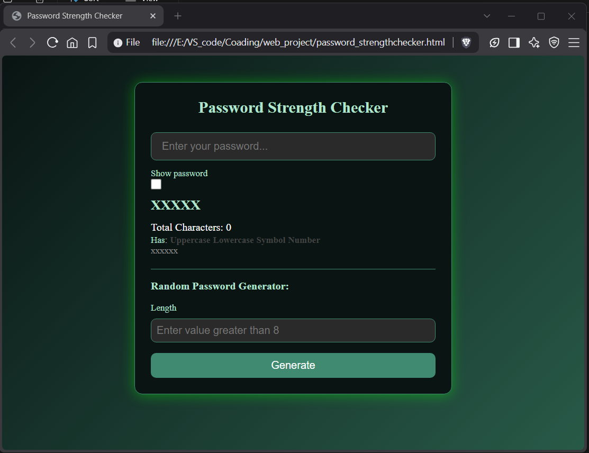
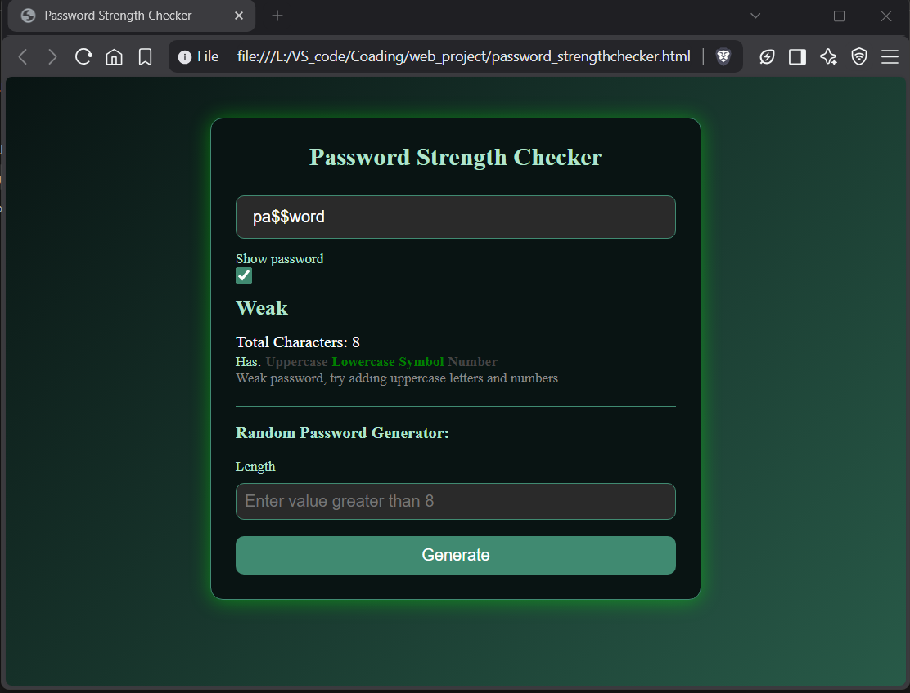
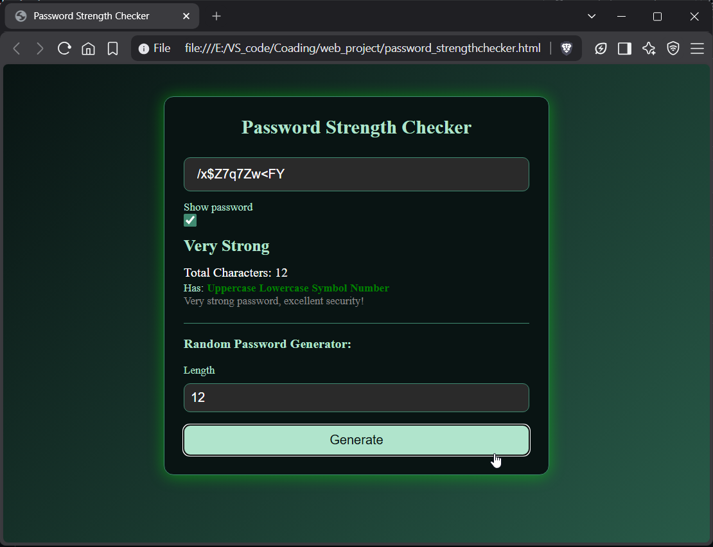

# Password Strength Checker

A real-time password strength checker with visual feedback and a built-in random password generator.

## Try it
https://projects-deploy.infinityfree.io/password_strength_Checker/index.html

## What it does

- **Live strength analysis** as you type — no submit button needed
- Scores passwords based on length and character variety (lowercase, uppercase, numbers, symbols)
- Gives a strength rating (`Very Weak` → `Excellent`) with contextual feedback on how to improve
- Highlights which character types are present (color-coded indicators)
- **Show/hide password** toggle
- **Random password generator** with adjustable length, built from the full character set (letters, numbers, symbols)

## How it works

The scoring system weighs both length and character diversity:
- Longer passwords earn more points (8+, 12+, and 16+ character thresholds)
- Each character type present (lowercase, uppercase, number, symbol) adds to the score, with symbols and uppercase weighted higher
- The final score is mapped to a strength tier via a rules table, each with its own label and feedback message

This rules-table approach makes it easy to tune scoring later without touching the core logic.

## Tech Stack

- HTML / CSS / vanilla JavaScript — no frameworks or dependencies

## Screenshots

    
    
    
    
  

**Very strong password:**
All requirements met, green indicators, top strength tier.

**Empty state:**
Clean default state before any input.

